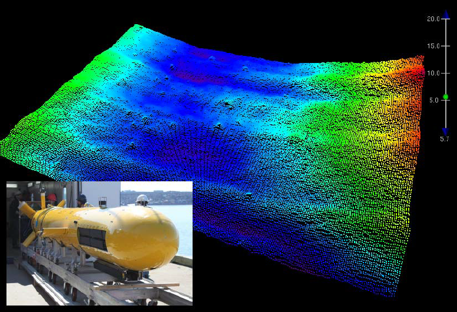
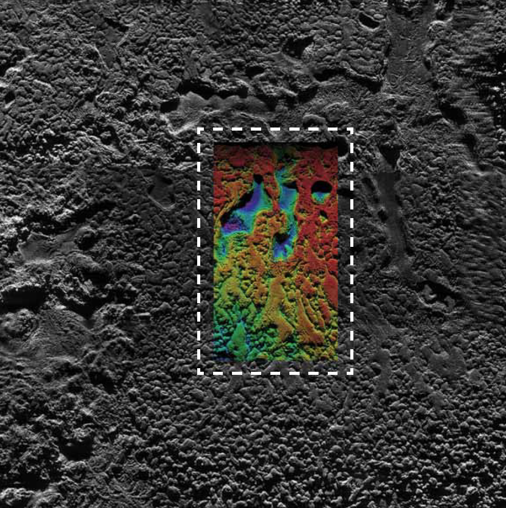
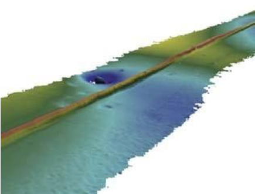
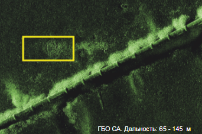
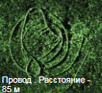
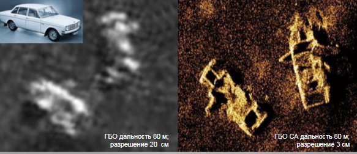

*Анализ работ в области применения ГБО СА*

*Изначально ГБО SAS разрабатывалось, как эффективное средство для
обнаружения мин \[1\]. Однако, в последствии SAS был апробирован как
универсальное гидроакустическое средство с большим потенциалом для
морской разведки нефтегазовых месторождений, региональных
геоморфологических исследований, построения навигационных карт,
подводной археологии, картирования бентических местообитаний и
глубоководной добычи полезных ископаемых.*

*Разведка и эксплуатация морских месторождений минеральных ресурсов -
быстроразвивающиеся область, обусловленная растущим спросом на
неблагородные металлы, отсутствием открытий новых экономически выгодных
месторождения на суше, а так же интенсивным развитием подводных
технологий нефтегазовой отрасли.*

*Для любой глубоководной разработки опасность представляют геологические
изменения, вызванные просачкой углеводородов , поскольку они ведут к
изменениям геотехнических свойств почв. Обследование области разработки
на предмет обнаружения характерных геологических признаков, таких как
покмарки (оспины), газовые сипы и газогидратные отложения и насыпи,
производятся при помощи АНПЫ, обеспечивающей высокоточное
батиметрическое, ГБО, профилографическое и фотографическое изображение,
а так же образцы грунта. Для определения физиографии морского дна
картографирование выполняется в мезомасштабе при предпроектной
подготовке \[2\].*

*Таким образом, картографирование морского дна в целях проведения
глубоководной разработки месторождений требует больших областей
обследования и данных с очень высоким разрешением.*

*В работе \[3\] показаны результаты применения SAS для глубоководных
обследований массивных сульфидных отложений на морском дне, образованных
гидротермальными системами в центрах тектонического распространения
плит. Cбор материала проводился в районе срединно-океанического хребта
Северного -Ледовитого океана. ГБО Kongsberg HISAS 1030 был установлен на
АНПА HUGIN.. На рисунках 1 - 2 приведены образцы полученных изображений
SAS, которые доказывают, что ГБО SAS - идеальный инструмент для съемки
больших площадей с минимальными временными затратами. Высокое разрешение
изображение SAS позволяет производить классификацию особенностей
морского дна и выполнять первичную оценку ресурсов месторождения, а так
же оценивать изменения структуры морского дна в результате ведения
глубоководной разработки.*

<figure>

<figcaption>
<em>Рисунок 1 Геотермальные признаки. Общее изображение
SAS. Приближенный фрагмент. Фотография объекта с
ТНПА</em>
</figcaption>
</figure>

<figure>

<figcaption>
<em>Рисунок 2 Структурные трещины и разломы на
изображении SAS. Рядом фотография объекта с ТНПА для
сравнения</em>
</figcaption>
</figure>

*На текущий момент гидрографическая отрасль начинает активно внедрять
технологию АНПА для регулярных обследований, очевидно, что в этом ключе
ГБО SAS будут играть более важную роль в этой области, так как SAS
технология позволяет получать изображения морского дна и батиметрию с
очень высоким разрешением по всей длине полосы обзора*.

*В совместной работе компаний Kraken Sonar и Carees \[4\] был рассмотрен
вопрос о создании точных батиметрических карт, соответствующих
стандартам OGP Seabed Survey Data Model (SSDM) and IHO S-100.на основе
данных, полученных при помощи интерферометрического ГБО SAS Kraken
AquaPix.*

*Высокое разрешение батиметрических данных ИГБО СА (рисунок 3) позволяет
создавать высокоточные трехмерные модели дна.*

<figure>

<figcaption>
<em>Рисунок 3 Батиметрические данные ИГБО СА, полученные
на аппарате ISE Arctic Explorer</em>
</figcaption>
</figure>

*В другой работе \[5\] рассматривается возможность создания точных
трехмерных карт с высоким качеством для проведения обследований
нефтегазовых трубороводов и кабельных линий. В работе был использован
интерферометрический ГБО HISAS 1030. На рисунке 4 приведен образец
комбинированного изображения ГБО СА и ИГБО СА*

<figure>

<figcaption>
<em>Рисунок 4 Поле лавы в регионе Арктического океана.
Мозика 300х250м.Цветная область - батиметрическое изображение ИГБО
СА</em>
</figcaption>
</figure>

*В работе \[Using Synthetic Aperture Sonar as an Effective Tool for
Pipeline Inspection Survey Projects - Conference Rio Acoustics 2015,
Jaun Caballini, Fernanda Viana\] приводятся результаты использования
ИГБО СА в обследованиях трубопровдов, как альтернатива ТНПА с камерой.
Полученные цифровые модели объекта позволяют четко увидеть место
провисания трубопровод (рис. 5)*

<figure>

<figcaption>
<em>Рисунок 5 Провисание трубопровода. Цифровая модель
дна (грид) на основе батиметрических данных ИГБО
СА.</em>
</figcaption>
</figure>

*Выше приведенные работы \[\] показали, что технологии ИГБО СА могут
эффективно применяться в гидрографических и инженерных обследованиях,
снижая стоимость операций и повышая качество изображений. Таким образом,
можно предположить, что технологии ГБО СА и ИГБО СА будут не менее
эффективны при выполнении сопровождения дноуглубительных работ при
оценке заносимости судоходных объектов, при инспектировании
гидротехнических сооружений портов и гидроузлов.*

Так же не вызывает сомнения целесообразность использования ГБО СА при
выполнении любых поисковых операций. На рисунке 6 приведены образцы
изображений ГБО СА Kraken Aquapix \[7\], демонстрирующие высокую
детальность изображения, которая позволяет различать предметы на фоне
дна.

{width="2.85in"
height="1.9in"}{width="1.075in"
height="0.9833333333333333in"}

<figure>

<figcaption>
<em>Рисунок 6 Изображения ГБО СА Kraken
Aquapix</em>
</figcaption>
</figure>

Список литературы:

1.  *Synthetic Aperture Sonar: A Review of Current Status - Michael P.
    Hayes, Member, Iand Peter T. Gough, Senior Member; JOURNAL OF
    OCEANIC ENGINEERING, VOL. 34, NO. 3, JULY 2009;*

2.  *Seafloor Mapping along Continental Shelves - Charles W. Finkl,
    Christopher Makowski ; Coastal Research Library. Vol.13*

3.  *The Use of Synthetic Aperture Sonar to Survey Seafloor Massive
    Deposits - Alden Ross Denny, Torstein Olsmo Sæbø, Roy Edgar Hansen,
    and Rolf Birger Pedersen; The Journal of Ocean Technolgy, Vol.10,
    No.1, 2015;*

4.  *Using synthetic aperture sonar as an effective hydrographic survey
    tool - Andy Hoggarth, Karl Kenny; The Journal Oceans 2014*

5.  *A New Approach to High-Resolution Seafloor Mapping - Hayden John
    Callow, Per Espen Hagen, Roy Edgar Hansen, Torstein Olsmo Sæbø, and
    Rolf B. Pedersen; Journal of Ocean Technology 2012*
