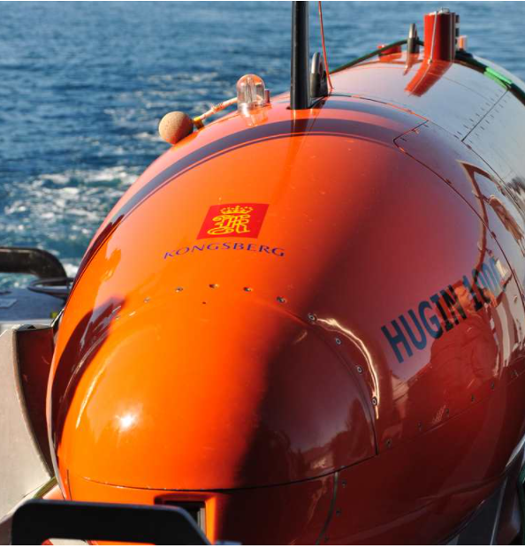
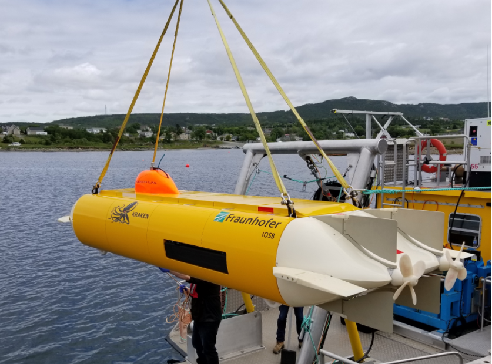
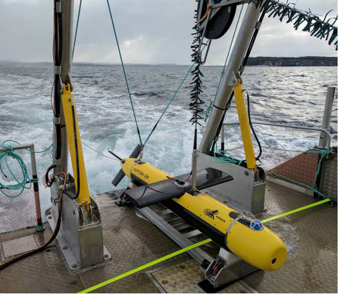

**Введение**

Для размещения гидролокатора с синтезированной апертурой традиционно
используются платформы, обеспечивающие стабильную линейную траекторию
движения. Обычные АНПА с узким корпусом обладают эффективными
гидродинамическими характеристиками и лучше всего подходят для
длительных миссий, которые должны осуществляться с высокой скоростью или
на большие расстояния. Способность аппарата перемещаться на большие
расстояния с большой скоростью позволяет использовать преимущества
системы с синтезированной апертурой и выполнять обследование с высокой
скоростью за счет большой площади покрытия.

**Платформы ГБО СА**

Наиболее известные платформы размещения ГБО СА приведены ниже:

- АНПА Kongsberg HUGIN 1000

Диаметр АНПА Hugin 1000 составляет 75 см. Рабочая глубина аппарата --
1000 или 3000 метров. Hugin -- модульная платформа со стандартной
носовой и хвостовой частями. Серединные секции комплектуются по заказу
потребителя в зависимости от выполняемых задач. Примерная длительность
работы при скорости 4 узла -- 24 часа. На рис.1 представлено изображение
АНПА Hugin.

<figure>

<figcaption>
Рисунок 1 АНПА HUGIN 1000
</figcaption>
</figure>

- АНПА Hydroid REMUS 600

> АНПА REMUS 600 был разработан для выполнения операций с большей
> длительностью, требующих большей грузоподъемности и большей глубины.
> REMUS 600 AUV может похвастаться тем же проверенным программным
> обеспечением и электронными подсистемами, что и наш очень успешный
> REMUS 100 AUV, с рейтингом глубины и расширенными возможностями,
> которые выводят автономные операции на новый уровень.
>
> АНПА REMUS предназначен для работы на глубинах до 600 м. Диаметр
> аппарата 32 см. Длительность операции - более 20 часов в зависимости
> от скорости движения и полезной нагрузки. АНПА REMUS - модульная
> система со сменной полезной нагрузкой. Вид аппарата представлен на
> рис. 2

Рисунок 2 АНПА REMUS

- АНПА THUNDERFISH

АНПА THUNDERFISH был разработан Aquapix, как аппарат с упрощенным
управлением и большей вместительностью. АНПА Thunderfish имеет
возможность удерживать положение за счет вертикально направленных
движителей. Изображение аппарата приведено на рис. 3

<figure>

<figcaption>
Рисунок 3 АНПА Thunderfish
</figcaption>
</figure>

- Буксируемое тело KATTIFISH

Представляет собой управляемое буксируемое тело. Диаметр корпуса -- 25
см, размах крыльев 1 м. Максимальная глубина работы 300 м ограничена
длиной кабеля. Скорость передачи данных с буксируемого тела на судно
носитель для обеих сторон ГБО СА (192 канала) -- 36 Мб/с. Изображение
системы представлено на рис. 4
{width="3.1621445756780404in"
height="2.730433070866142in"}

Рисунок 4 Буксируемое тело Kattifish

Характеристики платформ для размещения ГБО СА приведены в таблице 1.

Характеристики платформ ГБО СА приведены в таблице №1

+-------------------+-----------+---------+-------------+-------------+
| Характеристика    | Hugin     | Remus   | Thunderfish | Kattifish   |
|                   | 1000      | 600     |             |             |
+:=================:+:=========:+:=======:+:===========:+:===========:+
| Диаметр, см       | 75        | 32,4    | 95 x 50     | 25          |
|                   |           |         |             |             |
|                   |           |         | (ШхВ)       |             |
+-------------------+-----------+---------+-------------+-------------+
| Длина, м          | 4,5       | 2,7 --  | 3,5         | 3,5         |
|                   |           | 5,5     |             |             |
+-------------------+-----------+---------+-------------+-------------+
| Вес, кг           | 650 --    | 220 -   | 675         | 250         |
|                   | 850       | 385     |             |             |
+-------------------+-----------+---------+-------------+-------------+
| Скорость          | 2-6       | 4       |             | 8           |
| движения, уз      |           |         |             |             |
+-------------------+-----------+---------+-------------+-------------+
| Длительность      | 24        | 20      |             |             |
| операции, час     |           |         |             |             |
+-------------------+-----------+---------+-------------+-------------+
| Емкость           | 15        | 5,4     |             |             |
| аккумулятор, кВт  |           |         |             |             |
| ч                 |           |         |             |             |
+-------------------+-----------+---------+-------------+-------------+
| Рабочая глубина,  | 1000      | 600     | 1000        | 300         |
| м                 |           |         |             |             |
+-------------------+-----------+---------+-------------+-------------+

: Таблица 1 Характеристики платформ ГБО СА

**Сравнение АНПА и ТНПА**

Отношение длины к ширине аппарата напрямую влияет на его гидродинамику.
Длинные узкие аппараты подвержены меньшему лобовому сопротивлению на
высоких скоростях, но демонстрируют плохую способность удерживаться на
месте.

Короткие аппараты имеют лучшие возможности удержания на месте и большую
маневренность по всем трем осям движения, но на них действует большее
сопротивление при увеличении скорости.

АНПА обычно имеет классическую форму торпеды и минимальное количество
двигателей для более длительных миссий на более высоких скоростях. ТНПА,
напротив, применяются в задачах, требующих удержания на месте и более
тщательного осмотра, измерений и транспортировки инструментов, доставки
инструментов.

У АНПА закрытый контур, который обеспечивает обтекаемость аппарата и
формирования непрерывного потока вокруг контура аппарата. У ТНПА
открытая рама для того, чтобы поток циркулировал внутри рамы и
движетелей, которых у ТНПА больше.

Обычные АНПА с узким корпусом обладают эффективными гидродинамическими
характеристиками и лучше всего подходят для океанских миссий, которые
должны осуществляться с высокой скоростью или на большие расстояния. В
то время, как ТНПА больше подходят для локальных операций.

**Размещение ГБО СА на ТНПА**

Работы по применению ГБО СА на ТНПА практически не проводились, так как
обследование объектов при помощи ТНПА имеет несколько иную технику,
нежели площадное обследование, проводимое при помощи АНПА с ГБО СА.

Однако, Университетом Бата (Великобритания) была предпринята попытка
снизить стоимость использования ГБО СА при размещении гидролокатора на
ТНПА Blue Robotics. Для экспериментальных работ был использован
гидролокатор Picotech FLS40, характеристики приведены в таблице 2.

  -----------------------------------------------------------------------
  Характеристика                                       Значение
  ---------------------------------------------------- ------------------
  Центральная частота, кГц                             500

  Ширина полосы, кГц                                   40

  ДНА в азимутальной плоскости, °                      40

  Максимальная дальность, м                            70

  Частота, Гц                                          10

  Длина приемной антенны, м                            0,13

  Количество приемных элементов                        31

  Расстояние между приемными элементами, мм            4,45
  -----------------------------------------------------------------------

  : Таблица 2 Характеристики гидролокатора Picotech FLS40

Эксперимент проводился в бассейне. Гидролокатор был установлен на дно
ТНПА под углом 20 градусов. Движение ТНПА осуществлялось на скорости 1
м/с. Цели -- металлические сферы разного диаметра располагались на дне
бассейна на искусственном покрытии, имитирующем дно. Несмотря на
неравномерное движение аппарата в результате получилось улучшить
разрешение гидролокатора.

Эксперимент показал, что алгоритмы микронавигации применимы
гидролокатора при использовании его на ТНПА и, в целом, технология
синтеза применима для улучшения разрешения. Однако, изображение
получается несфокусированным и это предмет дальнейшей работы.

Других материалов о применении ГБО СА на ТНПА в литературе не найдено.

**Выводы**

Наиболее традиционной платформой для размещения ГБО СА является АНПА,
так как плавность хода и способность аппарата перемещаться на большие
расстояния с большой скоростью позволяет использовать преимущества
системы с синтезированной апертурой и выполнять обследование с высокой
скоростью за счет большой площади покрытия.

Малое количество работ в области применения ГБО СА на ТНПА не позволяют
однозначно утверждать, что использование ГБО СА на ТНПА возможно.

Целесообразно провести ряд экспериментов с макетом ГБО СА, размещенном
на ТНПА для оценки возможности использования подобной платформы для ГБО
СА.

**Список литературы**

1\. The ROV Manual, 3 -20. Christ, R. D., & Wernli, R. L. (2014).

2\. SYNTHETIC APERTURE SONAR FOR A LOW-COST AGILE PLATFORM: PRELIMINARY
RESULTS - Ciaran Sanforda, Alan Huntera, Picotech Ltd/ UACE2019 -
Conference Proceedings
