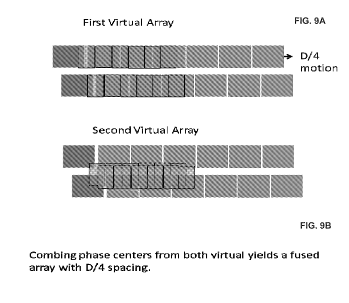
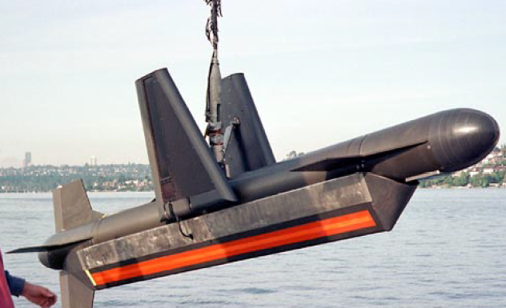

*В документе приведены описания систем SAS по патентам и диссертациям.
Даны компоновки и принципы для систем Darpa, Kiwi SAS, Westinghouse.*

*Коротко по собранным здесь описаниям, я поняла, что*

*- SAS используют технологию Вернье и делят основную решетку на
подрешетки с различными вариантами размещения передатчика.*

*- Наиболее типичное размещение передатчика - на концах приемной решетки
позволяет использовать ортогональные сигналы, проводить коррекцию фазы и
тд.*

*- Размещение передатчика в патентах не совсем соответствует размещению
передатчика, например, в Hisas или Darpa*

[*[PATENT SYNTHETIC APERTURE SEDE-LOOKING SONAR
SYSTEM]{.underline}*](https://patentimages.storage.googleapis.com/35/1f/27/6c83da00fa3c66/US4088978.pdf)

*Westinghouse Electric Corporation*

*Inventor George A.Gilmour, Severna Park*

*Год 1978*

*На рисунке 2 представлена схема приемника. Приемник 20 разделен на
шесть сегментов 20-1 -- 20-6. Передатчик обозначен на схеме буковой Т и
является сегментом 20-4 приемника. На рисунке показаны девять каналов в
качестве примера.*

{width="2.103043525809274in"
height="2.950819116360455in"}

*В описываемом примере система обеспечивает девять реальных лучей и три
луча с синтезированной апертурой.*

{width="1.1347222222222222in"
height="1.5590277777777777in"}

*Основной принцип, связанный с получением луча с более высоким
разрешением путем когерентного сложения множества лучей,
продемонстрирован на фиг. 6A и 6B.*

*На рис. 6а каждый канал 58 дает выходной сигнал. Сигналы складываются.
В результате получается сигнал e~0~ = e~1~ + e~2~ + e~3~ + e~4~ + e~5~ +
e~6~ с шириной луча равной β = λ /L .*

*Если решетка была разделена на две, как представлено на рис.6B, луч от
каждой половины будет выглядеть как e~01~ = e~1~ + e~2~ + e~3~ и e~02~ =
e~4~ + e~5~ + e~6~ соответственно иметь ширину β = λ/(L/2) или β =2 λ
/L, что в два раза увеличивает луч (рис. 6а). Если только три сегмента
используются для получения e~01~ для одного излучения и эти же три
элемента перемещаются для получения e~02~ на следующем излучении, при
сохранении сигнала e~02~ становится возможным реконструировать e~0~
путем когерентного сложения производных сигналов e~01~ и e~02.~ Таким
образом, получая луч с более высоким разрешением, чем от трех -
элементного приемника.*

{width="2.642361111111111in"
height="1.7847222222222223in"}{width="3.0409722222222224in"
height="1.6256944444444446in"}

*На рис. 10 показан приемник по мере его продвижения в течение четырех
последовательных импульсов от j до j+3. Хотя преобразователь
перемещается по одной и той же прямой линии, положения импульсов смещены
для наглядности.*

*Видно, что при эхо-сигнале j луч i формируется напротив сегмента 20-1
преобразователя, как на рис. 7. На следующем импульсе j+1 он напротив
канала 20-4 передатчика и приемника* *и на следующем импульсе j + 2 один
элемент спустя за каналом 20-6. Для каждой позиции импульса формируются
девять реальных лучей, а после первых трех позиций импульса формируются
три луча с синтетической апертурой, i, i + 1 и i + 2. Однако результаты
позиций импульса j + 1, j + 2 и j + 3 обеспечивают следующий набор лучей
с синтетической апертурой от i + 3 до i + 5 с последующим набором лучей
с синтетической апертурой, сформированным в результате позиции импульса
j + 2 до j + 4 и т.д.*

{width="2.8333333333333335in"
height="3.4590277777777776in"}

{width="2.887643263342082in"
height="2.9219072615923007in"}

[*[Patent electronic stabilization for displaced phase center
systems]{.underline}*](https://patentimages.storage.googleapis.com/82/2e/94/7cecd63d6efa7e/US4244036.pdf)

*Год 1978*

*Inventor Robert S.Raven*

*Было предложено устройство для компенсации движения уменьшения
расширения спектра. Предложено устройство гидролокатора со смещенным
фазовым центром с двойной апертурой. Устройство со смещенным фазовым
центром показано на рис. 6, 7, 8.*

{width="1.737765748031496in"
height="1.3958333333333333in"}

*Две приемные апертуры расположены со смещеннием друг относительно друга
в направлении равномерного движения. Одна из апертур может
использоваться для излучения или для излучения может быть использована
отдельная апертура.*

*Период между двумя последовательными излучениями настраивается таким
образом, чтобы перемещение носителя между излучениями было
приблизительно равно смещению эквивалентных центров апертуры (с учетом
как передачи, так и приема)*, *таким образом чтобы при последовательном
приеме первой и второй апертурами достигался эффект двух излучений -
приемов из почти неподвижной точки. Сигналы, полученные из почти
неподвижной точки, будут иметь минимальные доплеровские сдвиги. Разность
фаз между последовательными сигналами, принимаемыми гидролокатором,
будет чувствительна к боковому движению (перпендикулярному движению
основной носителя и смещению двух апертур) и к угловому движению,
вызывающему такие боковые движения между передачами.*

*На рис. 6 показаны два активных элемента 30 и 31, при этом активный
элемент, используемый здесь, является излучающим и /или принимающим
элементом. Каждый элемент заданной длины также известен как апертура.
Известно, что изученная элементом 30 энергия, будет отражаться объектом
32 и возвращаемая энергия будет улавливать приемным элементом 31. Эта
операция эквивалентна передаче и последующему приему энергии в точке 33
на полпути между элементами 30 и 31. Точка 33 известна как эквивалентное
местоположение пространственной выборки.*

*На рис. 7 показана линейка длиной L из элементов с 34 по 43.
Предположим, что элемент 38 является передающим, а элементы с 34 по 43
являются принимающими. Рисунок 7 эквивалентен разделению передач от
фиктивных фазовых центров, расположенных на полпути между приемником и
передатчиком. Фиктивные фазовые центры или эквивалентные местоположения
пространственных выборок показаны черными точками,* *занимающими длину L
/ 2 с расстоянием между точками равным L / 20. Таким образом, если
носитель перемещается на расстояние L / 2 между импульсами, доступен
непрерывный набор пространственных выборок. Таким образом, разрешение L
/ 20 может быть достигнуто, при движении носителя на L/2 между
импульсами.*

{width="3.6538188976377954in"
height="1.3263888888888888in"}

[*[Patent SYNTHETIC APERTURESIDE-LOOKING SONAR
APPARATUS]{.underline}*](https://patentimages.storage.googleapis.com/16/ad/26/309eb1daff2f9f/US5295118.pdf)

*Inventor: Serge A. Gilmour*

*1993*

*Гидролокатор бокового обзора с синтезированной апертурой, который
включает в себя приемную решетку и два -передатчика. Когда устройство
находится в первом положении, на передний передатчик подается сигнал с
частотой F1, а на задний передатчик подается сигнал с частотой F2. При
следующем положении носителя частоты на передатчиках меняются на
противоположные.*

*В настоящем изобретении используется приемник с длиной, эквивалентной
длине, показанной на фиг. 6, однако, с вдвое меньшим количеством
элементов, что требует меньшего количества каналов обработки сигналов
для формирования приемных лучей.*

{width="4.322916666666667in"
height="1.71875in"}

> *На рис. 7A более подробно показано устройство антенн. Видно, что оно
> включает в себя приемник R, имеющий множество элементов e, и
> дополнительно показаны первый и второй передатчики T1 и T2,
> расположенные на переднем и заднем концах приемника. Приемник имеет
> длину L, и в одном варианте расстояние между передатчиками равно t,
> причем каждый передатчик выполнен с возможностью перекрытия,
> соответственно, первого и последнего элементов приемника.*

{width="4.71875in"
height="1.9166666666666667in"}

> *На рис.7 показаны три положения антенн. Сплошными линиями -
> устройство антенн в текущем положении, слева от которого, как показано
> пунктиром, находится устройство в предыдущем положении, а справа от
> которого пунктирными линиями показано устройство в последующем
> положении.*
>
> *Видно перекрытие переднего и заднего передатчиков T1 и T2.*
>
> *В настоящем изобретении используются две разные частоты передачи F1 и
> F2. Сигнал F1 подается на первый передатчик, в то время как F2
> подается одновременно на второй передатчик, а затем частоты меняются
> местами для следующего положения устройства.*

{width="3.456806649168854in"
height="4.452036307961505in"}

> *Этот процесс показан на рис. 8, на котором устройство показано в
> четырех разных положениях. В каждом положении устройство смещены
> относительно предыдущего по линии C.*

{width="3.565304024496938in"
height="1.1635356517935258in"}

*Это устройство критикуется в патенте Thales Group, приведенном ниже.
Попеременная передача на разных частотах не приводит к увеличению
скорости носителя без потери производительности. Каждый спектральный
компонент синтетической антенны недодискретизирован (undersampled) в два
раза, и это верно для всей синтетической антенны. Поэтому потеря
производительности идентична потере производительности Традиционного
метода.*

*Патент [[SIDE SCAN SONAR WITH SYNTHETIC
ANTENNA]{.underline}](https://patentimages.storage.googleapis.com/ad/ea/0c/875f4578941b54/US6215730.pdf)*

Assignee: Thomson Marconi Sonar S.A.S (THALES GROUP)

Inventor: Marc Pinto, Brest (FR)

1999

*Устройство ГБО с синтезированной апертурой, в котором два передатчика,
работающие в интерферометрическом режиме, размещены на концах антенны
гидролокатора. Скорость движения ГБО выбрана таким образом, чтобы нули
физической приемной антенны совпадали с одним из двух боковых лепестков
диаграммы излучения синтетической антенны. Такая схема работы
увеличивает дальность и, следовательно, скорость покрытия площади
гидролокатором.*

*Известны антенны с синтезом апертуры, в которых виртуальная антенна
формируется из N различных пространственных положений физической
антенны, такой как антенна 102 на фиг. 1.*

{width="2.833902012248469in"
height="1.5561472003499563in"}

*Предлагаемое устройство (рис.2.) использует два передатчика 211 и 221,
расположенных на концах антенны 202, для излучения сигналов на частоте f
с шириной β .*

{width="4.186888670166229in"
height="1.6938659230096238in"}

*Рис 2*

*Чтобы увидеть вклад интерферометрической передачи, приводится анализ
лепестков физической антенны. Изменение касается передатчика, выражение
которого становится*

*, где L~e~\<\<L размер индивидуального передатчика,
u=sinθ*{width="1.68in"
height="0.45559273840769904in"}

*Этот лепесток представлен на рис. 2, где видно, что в отличие от
традиционного излучения у него нули в направлениях*

{width="0.825in"
height="0.5126213910761155in"}

*Это обеспечивает дополнительную возможность подавления лепестков
решетки синтетической антенны, которые сами также представлены на фиг.
2. Они могут быть отменены лепестком физического приема, который также
представлен на фиг. 2, которая принимает условный вид (2), в
направлениях*

{width="0.6347123797025371in"
height="0.464423665791776in"}

{width="3.2917694663167105in"
height="4.471334208223972in"}

*Результат передачи/приема определяется как:*

{width="5.388910761154856in"
height="0.6062521872265967in"}

*Последний член идентичен обычному лепестку направленности физической
антенны двойной длины 2L. Результатом этого является то, что свойства
синтетической антенны с интерферометрической передачей в любой точке
эквивалентны свойствам физической антенны двойной длины, работающей в
однолучевом режиме, причем канал приема направлен вдоль оси антенны. В
частности, условие частоты излучения? (sampling condition) можно
записать*

{width="1.6770833333333333in"
height="0.3020833333333333in"}

*Что касается длины синтетической антенны, она имеет значение:*

{width="0.8513484251968504in"
height="0.549828302712161in"}*или*
{width="1.128231627296588in"
height="0.47864391951006124in"}

*Однако для работы без пробелов сбоку в покрытии сбоку необходимо
находиться в зоне перекрытия отдельных покрытий 302 и 303 т.е. за
пределами расстояния p, которое ограничивает слепую зону 301,
представленную штриховкой на фиг. 3, что делает необходимым следующее
дополнительное условие:*

{width="1.1166666666666667in"
height="1.0204024496937882in"}

{width="2.02380905511811in"
height="1.915356517935258in"}

*Следовательно, диапазон должен превышать 2L, и это условие чаще всего
выполняется для боковых сонаров, у которых все еще есть слепая зона в
начале своего диапазона. Таким образом, видно, что разрешение
Интерферометрического передатчика Синтетической антенны по крайней мере
в два раза лучше, чем у физической приемной антенны длиной L.*

*К сожалению, дальнейшее развитие системы Thales не получается
отследить, так как материалы последующих патентов закрыты.
Предположительно за патентами Thales лежит система Synthetic Aperture &
Mine Detection Imaging Sonar (SAMDIS), но информации по ней тоже не
представлено.*

{width="5.513437226596675in"
height="2.505358705161855in"}

[*[SYNTHETIC APERTURE SONAR AND SYNTHETIC APERTURE PROCESSING
METHOD]{.underline}*](https://patentimages.storage.googleapis.com/88/fa/7e/d8abd28882ac53/US6594200.pdf)

*JP 2803658 7/1998*

*Inventor: Yoshiyuki Nakamura*

*Assignee: NEC Corporation*

*Jan. 16, 2002*

*Представленное устройство имеет апертурную решетку, разделенную на две
подрешетки Вернье. Подрешетки одновременно излучают сигналы разной
формы. Можно увеличить [space sampling points количество точек
пространственной]{.mark} [выборки]{.mark}? , полученных при одном
излучении при помощи разделения сигнала на подрешетках. При
использовании этого метода создаются точки перекрытия, эквивалентные по
фазе, даже если сонар движется с обычной скоростью, а колебания между
эхо-сигналами обнаруживаются и корректируются методом перекрытия.*

*На рисунке 9 представлена схема традиционной системы с синтезом
апертуры. На рисунке 10 представлен способ разделения апертуры на две
решетки Вернье.*
{width="2.397222222222222in"
height="2.8340277777777776in"}{width="2.548611111111111in"
height="2.7493055555555554in"}

*Описание традиционной системы рис. 9. Излучение сигнала 1 выполняется
решеткой 110 длиной D для обнаружения объекта 102 в азимутальной позиции
s1. Следующий сигнал 2 излучается через пройденной сонаром расстояние
D/2. Процесс излучения -- приема повторяется N раз и синтезирование
выполняется на базе N сигналов. Таким образом, разрешение RES=D/2 , а
скорость носителя PRF\*D/2. Более того, так как излучение и прием
выполняются одной решеткой, нельзя определить точку фазового перекрытия
и, соответственно, сложно исправить колебания в траектории методом
перекрытия.*

*На рис. 10 показано разделение на две подрешетки. Решетка 110 разделена
на лые части и таким образом антенна состоит из передней 112 и задней
111 решеток. Задняя решетка 111 (подрешетка с длиной D\|2) излучает
сигнал и обе задняя 111 и передняя 112 решетки принимают отраженный
сигнал. В это время входной сигнал на задней решетке 111 равен
излучаемому и приемному сигналу положения S1,1 (положение смещения
сонара на D/4 от самой задней части задней решетки 111). Входной сигнал
передней решетки 112 равен сигналу в положении S1,2. Это отношение
называется Displaced Phase Center. В таком случае разрешение RES
становится вдвое больше, чем у традиционного метода, при смещении D/4
сонар проходит путь D/2 и скорость носителя все равно равна PRF\*D/2.
Нельзя определить точку фазового перекрытия и, соответственно, сложно
исправить колебания движения методом перекрытия.*

*Схема предлагаемого метода перекрытия по решетка представлена на рис.
12. Структура антенны такая же как и на рис.10 . В представленном методе
сонар смещается на расстояние D/4 при каждом
излучении*{width="2.975in"
height="2.453472222222222in"}

*Первый излученный -- принятый сигнал 1 в положении S1,1 и S1,2 .
Следующий сигнал 2 в положениях S2,1 и S2,2, когда сонар сместился на
расстояние D/4. Соответственно сигнал 1 положения S1,2 и сигнал 2 в
положении S2,1 находятся в одном и том же месте. Соответственно, по
отклонению можно исправить изменение положения сонара.*

*На рис. 13А и 13B показана коррекция фазового отклонения в
пересекающихся точках сигнала 1 и 2. Рис. 13а показывает время приема t1
сигнала 11 передней решеткой 112 сигнала 132, рис. 13B показывает время
приема t2 задней решеткой 111 сигнала 132.*

{width="3.71875in"
height="2.3645833333333335in"}

*Применение коррекции за счет перекрытия снижает скорость движения
носителя, снижает дальность действия. Для преодоления этих ограничений
предложено изобретение.*

*Суть изобретения приведена на рис.1 Апертура сонара разделена на заднюю
1 и переднюю 2 решетки. Обе решетки принимают и передают. В устройстве
используются два типа сигнала: ЛЧМ восходящий Wa(t) и ЛЧМ нисходящий и
Wb(t) разнесенные по полосе. Схема работы сонара представлена на рис. 1
и 4. Задняя решетка 1 излучает сигнал 1 формой* *Wa(t), а передняя
решетка 2 почти одновременно излучает сигнал 2 формой Wb(t) (S1 рис 4).
Затем два сигнала отражаются целью 102 и возвращаются на апертуру.
Добавляются два сигнала* Wa(t) и Wb(t). *Решетки 1 и 2 принимают и
разделяют сигналы. (S2 рис.4). В случае изобретения корреляция между
входными сигналами и репликой позволяет разделить сигналы. Излученная
форма W1(t) и эхо от W2(t) независимо разделены. Два типа отклика могут
быть получены решеткой, а значит четыре типа отклика могут быть получены
передней и задней решетками.*

*На втором излучении 2 сонар смещается на расстояние D/2 b цикл
излучения -- прием повторяется (S3 рис.4). Для исключения влияния
колебания движения выполняется кросс-корреляционная обработка между
сигналом 1 на передней решетке 2 и сигналом 2 на решетке 1 (S4 рис. 4).
Следовательно, пик корреляции обнаруживается с задержкой по времени
(τ=cδ) пропорционально величине отклонения между первым и вторым
сигналом. Серия циклов излучения -- приема, в которых не включена ошибка
движения повторяется (в случае Y S6 рис 4). Затем, после требуемого
числа циклов производится компрессия.*

*Как показано на рис. 2 и 3 четыре отклика получены решетками 1 и 2
Исходя из отношения Displaced Phase Centers эти четыре сигнала фазово
эквивалентны в средних точках решеток 1и 2. Следовательно, становится
возможным реализовывать трехточечную выборку одним излучением. Таким
образом, достигается разрешение D/4.*

*В дополнение формируются два независимых изображений от сигналов Wa(t)
и Wb(t), что похоже на two-look обработку из multi-look. (не найден
эквивалентный термин). Что позволяет снизить спекл - шум в
изображениях.*

*Патент SYSTEMS AND METHODS FOR SYNTHETIC APERTURE SONAR*

*Inventor: RIKOSKI, Richard*

*Proprietor: Hadal*

*2012*

*Представлены методы синтезирования апертуры гидролокатора,
использование ортогональных сигналов с перекрытием множественными
передатчиками, а так же метод одновременной локализации и построения
карты (SLAM) по голографическому изображению.*

*На рисунке 1 представлена блок - схема гидролокационного
-картографического устройства.*

*Система 100 включает в себя гидроакустический блок 110 для отправки и
приема сигналов сонара, препроцессор 120 для обработки принятого (или
отраженного) сигнала и согласованный фильтр 130 для выполнения сжатия
импульсов и формирования диаграммы направленности. Система 100
сконфигурирована для обеспечения возможности навигации с использованием
высокочастотных (более примерно 100 кГц) сигналов сонара. Чтобы
обеспечить такую ​​ВЧ-навигацию, система 100 включает в себя корректор 140
сигнала для компенсации ошибки угла скольжения и для исправления ошибки
фазы. Система 100 также включает в себя детектор 150 сигнала для
когерентной корреляции принятого изображения с картой. В определенных
вариантах осуществления система может быть установлена ​​на транспортном
средстве, перемещающемся по местности, таком как автономный подводный
аппарат (AUV) или беспилотный летательный аппарат (БПЛА). В таком
исполнении ения система 100 включает в себя бортовой навигационный
контроллер 170, контроллер 180 двигателя и контроллер 190 датчиков.
Навигационный контроллер 170 может быть сконфигурирован для приема
навигационных параметров от линии 172 GPS / RF (при наличии),
акселерометра 174, гироскоп и компас 176. Контроллер 180 двигателя может
быть выполнен с возможностью управления множеством двигателей 182, 184 и
186 для управления транспортным средством. Контроллер 190 датчиков может
принимать измерения от монитора 172 аккумуляторной батареи, датчика 194
температуры и датчика 196 давления. Система 100 дополнительно включает в
себя центральный блок управления (CCU) 160, который может служить в
качестве концентратора для определения навигационных параметров на
основе измерений сонара и других параметров навигации и датчиков, а
также для управления движением
НПА.*{width="4.145833333333333in"
height="5.7340277777777775in"}

*Как отмечалось выше, система 100 включает в себя гидроакустический блок
110 для передачи и приема акустических сигналов. Гидролокатор состоит из
решетку 112 преобразователей, имеющую один или несколько излучающих
элементов и множество принимающих элементов, расположенных в ряд.
Антенная решетка 112 может работать в режиме SAS (либо в режиме Street
map, либо в режиме Spotlight) или в режиме реальной апертуры. Пример
антенной решетки приведен на рис. 3. Решетка состоит из одного
передающего и шести приемных
элементов.*{width="2.7756944444444445in"
height="1.4479166666666667in"}

*Представленные системы и способы имеют несколько передатчиков и
формируют ортогональные сигналы для повышения производительности системы
SAS. В частности, описанные здесь системы и способы включают в себя SAS,
с низким уровенем боковых лепестков (рис. 8-9В) и высокой скоростью
покрытия за счет использования нескольких передатчиков (рис. 10 -11C), и
перекрывающую последовательность импульсов.*

*Как правило, боковые лепестки решетки возникают, когда активные
элементы сонара разнесены на одну или несколько длин волн. Боковые
лепестки решетки не могут быть полностью подавлены, если расстояние
между элементами превышает половину длины волны. Для большинства
активных гидроакустических систем такое расстояние нецелесообразно,
поскольку для этого потребуется чрезвычайно большое количество каналов и
всенаправленные элементы. Вместо этого в большинстве систем используются
более крупные преобразовательные элементы с ограниченными диаграммами
направленности. Результирующая диаграмма направленности
гидроакустической системы формируется диаграммой направленности луча
решетки (включая лепестки решетки) и диаграммами направленности
отдельных элементов. Элементы передатчика и приемника имеют
соответствующий размер (например, ширину) d, и в предположительный
фазовый центр классический интервал SAS «d / 2», как показано на рисунке
9A.*

*Согласно рисунку 9В можно увеличить частоту излучения например до d/4
или выше.*

{width="4.106642607174103in"
height="3.5706496062992126in"}

*Гидролокатор с синтезированной апертурой находится в постоянном
движении, так что он может накапливать много импульсов / фазовых
центров, чтобы создать изображение с очень высоким разрешением. Система
излучает ортогональные сигналы после очень короткой задержки для
создания дополнительных фазовых центров между исходными фазовыми
центрами, чтобы их можно было добавить при обработке для создания
массива с дискретизацией d / 2N, где N\> 1. Фактически, SNR больше не
ограничивается лепестками решетки.*

*Как отмечено ранее N\>1. В некоторых исполнения N=2, т.е. сэмплирование
равно d/4. Каждый импульс имеет длительность Tp. Каждый импульс может
быть ортогональным к одному или более предыдущих импульсов таким
образом, что ортогональные импульсы перекрываются, а не ортогональные --
нет.*

*Например, если N=2, ширина передатчика d=0,1м, устройство двигается со
скоростью 1 м/с, время между первыми импульсами в цикле = 1с, а длина
импульса 0,2 с. Запуск первого импульса произойдет в момент времени t=0.
В момент времени t=0,025c устройство переместится на расстояние d/4 и
передатчик будет запускать второй импульс. Между 0,025с и 0,2 с оба
первый импульс и второй ортогональный импульс излучаются. Между 0с и
0,025с только первый импульс излучается, между 0,2 и 0,225с только
второй ортогональны импульс излучается.*

*Рассмотрим систему с решеткой длиной 1 метр, состоящей из
10-сантиметровых элементов и 10-сантиметрового передатчика. Виртуальный
массив фазовых центров имеет длину 50 см с фазовыми центрами,
расположенными на расстоянии 5 см друг от друга. В традиционном SAS
носитель будет излучать, перемещаться на 50 см и снова передавать.*

*В настоящем изобретении, работающем с интервалом d/4, носитель будет
излучать, смещаться на расстояние 2,5 см, излучать ортогональный сигнал
(чтобы не заглушать исходный сигнал), перемещаться на дополнительные
47,5 см, а затем повторять цикл. Если носитель двигался со скоростью 1 м
/ с, задержка между сигналами составила бы 1/40 секунды или 25 мс. Если
длина импульса длиннее, чем 25 мс, то два ортогональных сигнала будут
накладываться. В таком случае сигналы должны быть спроектированы так,
чтобы при суммировании они не перегружали приемник.*

*Изобретателем было обнаружено, что размещение пары передатчиков на
расстоянии L друг от друга приводит к эффективной длине решетки L
(большую, чем у систем предыдущего поколения с эффективной длинной
решетки L/2). Передатчики традиционно размещены подальше от приемной
решетки, потому что, если они будут размещены по обе стороны от приемной
решетки, они будут удалены друг от друга не на расстояние L , а на
расстояние L + D. Этот интервал приводит к появлению виртуальных
решеток, в которых может отсутствовать элемент, что приводит к боковым
лепесткам.*

*Предложенный метод включает в себя использование нескольких
передатчиков с ортогональными сигналами, запускаемыми несинхронно, а так
же использование задержек и движения носителя для формирования
соприкасающихся виртуальных решеток.*

*Дан приемник из N элементов размером d, с передатчиками размера d по
обе стороны от приемника. Передний передатчик начнет передачу первым,
затем с задержкой по мере того, как носитель смещается вперед на d / 2,
задний передатчик начинает излучать, как показано на фиг. 11A-C.*

{width="3.0479166666666666in"
height="3.8131944444444446in"}

*Способ позволяет размещать множество передатчиков вдоль носителя.
Например, если использовались четыре передатчика, расположенных на
расстоянии L друг от друга (для общей длины 3L), эффективная длина
приемника равна 2L, а степень покрытия зоны системы увеличивается в
четыре раза по сравнению с базовой SAS. Если M передатчиков используются
для удлинения массива, зона покрытия увеличивается в M раз по сравнению
с базовым покрытием. Аналогичным образом, пары вертикально смещенных
передатчиков могут быть добавлены для создания интерферометрической
решетки.*

*Overpinging*

*Используя ортогональные сигналы, можно улучшить отношение сигнал / шум
(SNR), но принимать во время передачи все равно будет почти невозможно.
Для системы с классическим диапазоном R это означает, что может быть
(почти) всегда невозможно наблюдать эхосигналы на расстояниях сразу
после R.*

*Представленное изобретение решает этот вопрос добавления нескольких
передатчиков, которые разнесены и срабатывают в определенном порядке,
для восстановления данных с одной дальности и положения фазового центра
и гарантировать, что измерение не «заклинило».*

*В примере рассмотрим массив длиной L и максимальной классической
дальностью R SAS при скорости V (V \* dt = L / 2, R = cl2 \* dt = cL /
4V) с задержкой между импульсами dt = L / 2V.*

*Предположим, что передатчики (0 на носу, увеличивающемся расстояния на
корме) находятся в положении x = 0, x = 0,25L, x = 0,6L. Чтобы второй
передатчик сформировал ту же виртуальную решетку, что и первый, он
должен отложить срабатывание до тех пор, пока носитель не переместится в
нужное положение (что соответствует примерно 0,25 dt). Точно так же,
если используется третий передатчик, он должен быть задержан на 0,6dt.
Предположим, что импульс 1 сформирован с использованием передатчиков 1 и
2, импульс 2 сформирован с использованием передатчиков 1 и 3, импульс 3
сформирован с использованием передатчиков 2 и 3, а затем
последовательность повторяется. Таким образом, время излучения может
быть:*

{width="3.9166666666666665in"
height="0.8854166666666666in"}

*Комбинация излучений тогда следующая \[0, 0.25, 1, 1.6, 2.25, 2.6, 3,
3.25, 4, 4.6, 5.25, 5.6, etc\]\*dt. Передатчики 1 и 2 формируют
виртуальные решетки для положения импульса 1. Так как новыми импульсами
образуется «пробка», виртуальная решетка 1 импульса 1 будет в проке на
следующих дальностях : \[0.25, 1, 1.6, 2.25, 2.6, 3, 3.25, 4, 4.6, 5.25,
5.6, etc\]\*R. На этих дальностях свободна виртуальная решетка 2, то
есть можно ее использовать для этих дальностей.*

***Darpa SAS***

*Антенная система Darpa SAS (на рисунке ниже) состоит из одного
передатчика, расположенного в крыле и приемной решетки из 16
гидрофонов.*

{width="4.343491907261592in"
height="2.4130511811023623in"}

{width="4.830249343832021in"
height="2.9425535870516186in"}

*Параметры системы Darpa*

*Сигнал: ЛЧМ нисходящий*

*Длительность сигнала: 25 мс*

*Ширина полосы: 10 кГц*

*Центральная частота: 50 кГц*

*Ширина приемной решетки: 22 см*

*Изначально рассматривалось использование широкой полосы для
«размазывания» боковых лепестков. Согласно доказательствам Hawkins,
приведенных в его работе, существенное подавление боковых лепестков
происходит при фактор Q ≤ 1,5. Q определяется как отношение центральной
частоты, в Гц к полосе, в Гц.*

*На рисунке приведено (а) боковые лепестки при параметрах Darpa --
частота 50 кГц, полоса 10 кГц, Q=4, уровень боковых лепестков -40 дБ,
(б) полоса увеличена до 33,3 кГц Q = 1,5.*

{width="5.158513779527559in"
height="2.3157141294838146in"}

*Однако, широкополосные сигналы не убирают энергию боковых лепестков, а
только размазывают ее. Поэтому Darpa так же использует технику Вернье
(или Displaced Phase Center Concept) для решения проблем
неоднозначности.*

*KONGSBERG HISAS 1030*

*Устройство антенны KONGSBERG HISAS 1030 приведено на рисунке. Сами
антенны красные.*

{width="2.7991535433070864in"
height="1.7562248468941382in"}

*Передатчик представляет собой вертикально - фазированную решетку,
состоящую из 16 приемо-передающих элементов. Размещен между приемными
решетками.*

*2 приемных решетки на сторону. Ориентированы горизонтально. Количество
элементов в решетке - 32. Длина 1,2 м. Ширина 30 см (20 лямбда). На
рисунке видно, что приемные решетки разделены на секции.*

*KRAKEN AQUAPIX INSAS 60/120*

*Антенны KRAKEN AQUAPIX INSAS состоят из двух передающих решеток:
дальнего и ближнего действия. Передатчики расположены вертикально с
разным углом наклона.*

*А так же из 2х приемных решето, дальнего и ближнего действия,
ориентированных горизонтально. Количество элементов в приемной решетке
-- 32. Рисунок антенн ниже.*

{width="2.772222222222222in"
height="1.9194444444444445in"}

{width="2.567361111111111in"
height="1.6743055555555555in"}

*ВОПРОС*

*Я так муторно собирала информацию по SAS для того чтобы спросить:*

*- почему наша система будет 8 канальной, когда все используют большее
число каналов?*

*- я не совсем поняла применение подрешеток и displaced phased centers.
Можно ли будет применять это к нашей системе о восьми каналах?*

*- я не дописала, что Kraken, Hisas и даже экспериментальная Kiwi SAS
используют две частоты для работы на разных дальностях, а мы заявляем
одну. Может быть стоит говорить о паре частот?*
